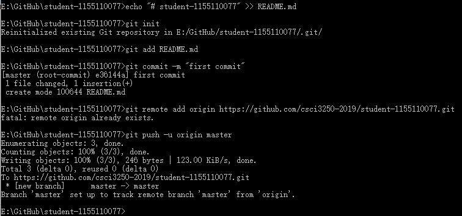

# sutdent-1155110077

`csci 3250 project milestone 2#`

## Welcome to my first repository

	 :alien: I am Lin Chuanfeng from the major of
	Computer Science. I am really a fresher in GitHub 
	and I wish I can master it in the future. 

- [x] Try GitHub (done!)
- [x] Create an account (done!)
- [x] On your computer, create a folder for a new git local repo (git init)
- [x] Create a new file readme.md using Markdown to include...
- [x] Add and commit this to your local repo
- [x] Create a new repo on our GitHub organisation: https://github.com/csci3250-2019
- [x] The new repo must have this name: student-1155xxxxxx where 1155xxxxxx should be your student ID
- [x] Push your local repo (which only includes readme.md) into this new GitHub repo

task|content
-|-
Milestone 1#|Sign up GitHub
Milestone 2#|First repository

To know more about me, vist A Playgroud for CSE students to explore my articles.

- [Tencent Visit Report](http://course.cse.cuhk.edu.hk/~csci3250/tencent-visit-report-3/)
- [Google Campus Talk](http://course.cse.cuhk.edu.hk/~csci3250/google-campus-talk/)
- [IDE and Editors](http://course.cse.cuhk.edu.hk/~csci3250/ide-and-editors/)

Screenshot of Git commands:
